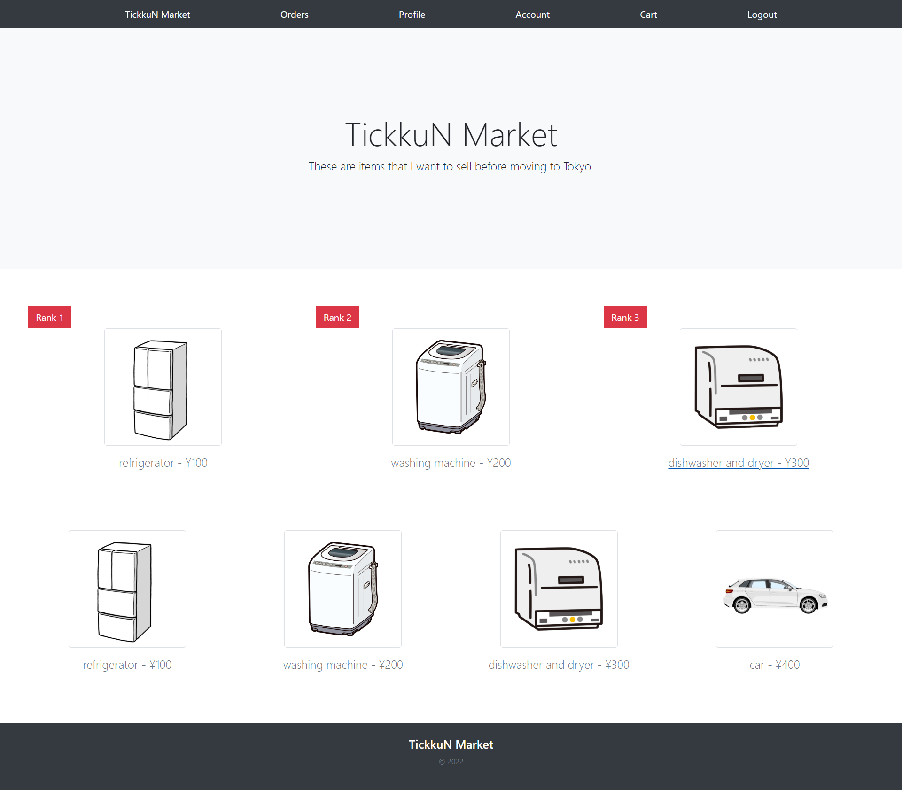

# 008_Eighth_Step-Python-Django
## 1. このリポジトリをダウンロードしてください。
<a href="https://github.com/TickkuN/008_Eighth_Step-Python-Django/archive/refs/heads/master.zip" target="_blank"> Python-Django </a>  
  
## 2. 解圧してください。 

## 3. Windows PCを使用している場合は以下のコマンドを入力してください。

venv\Scripts\activate

補足：Windows 10では、execution of scripts is disabled on this systemというエラーがWindows PowerShellに出ることがあります。 その場合は、Windows PowerShellを「管理者として開く」で、管理者権限で新しくウィンドウを開いてください。 そして、仮想環境を起動する前に、以下のコマンドを入力してください。

Set-ExecutionPolicy -ExecutionPolicy RemoteSigned

## 4. Mac PCを使用している場合は以下のコマンドを入力してください。

venv/bin/activate

## 5. 以下のコマンドを入力してください。

python manage.py runserver

## アプリを楽しんでください。

http://127.0.0.1:8000/

## 今回はアプリを見てもらいたいのでシークレットキーなどもアップしております。ポートフォリオなので公開しています。本番環境では秘密にしておきます。

